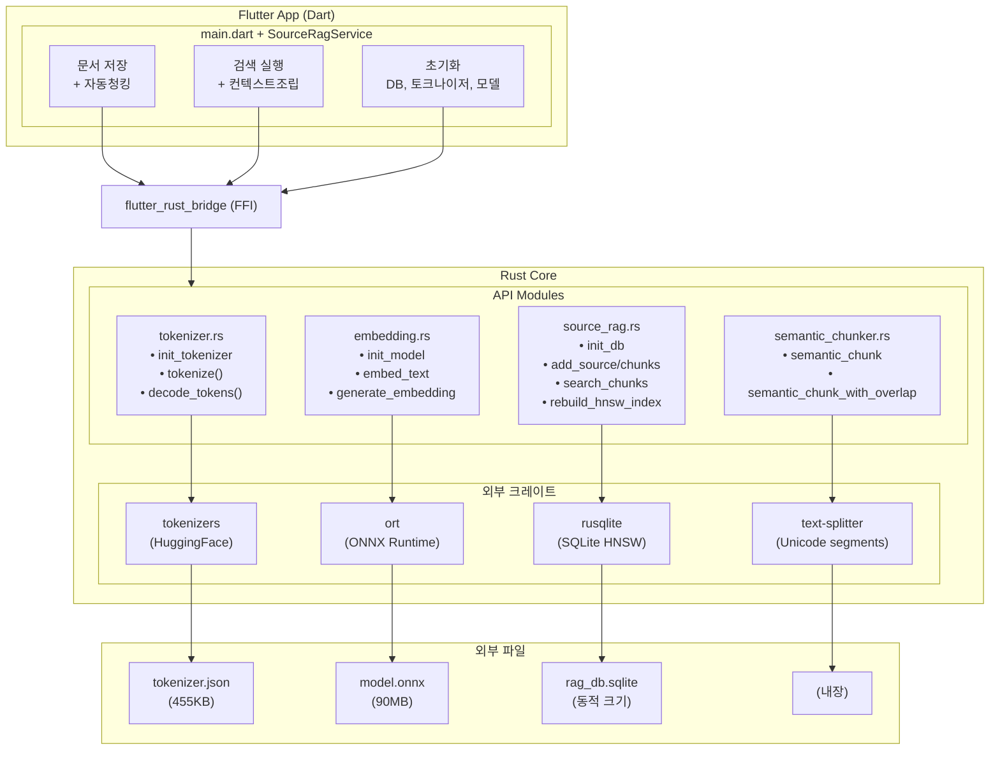
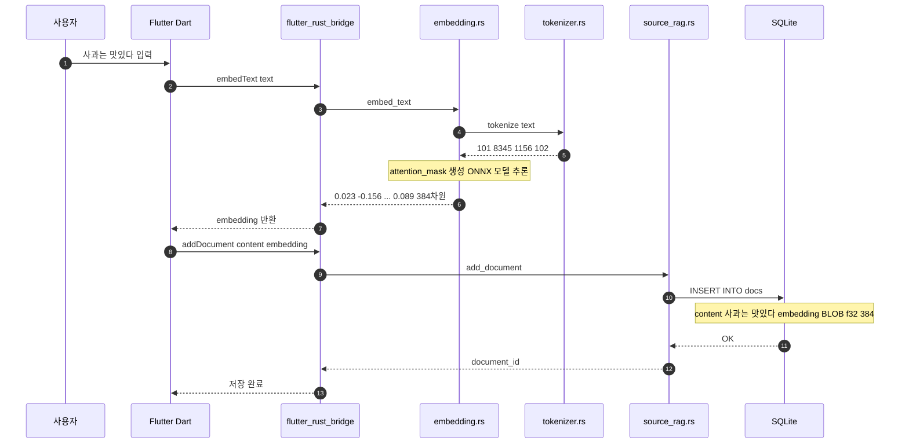
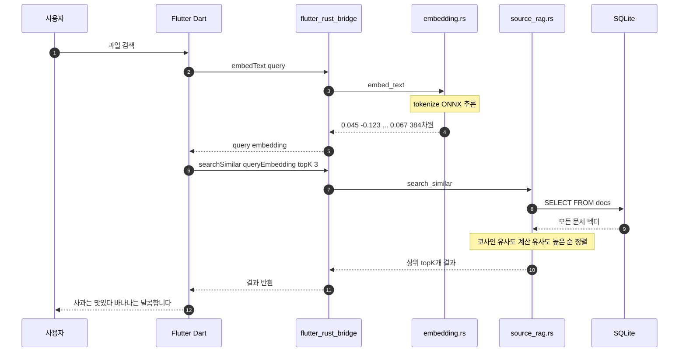

# Mobile RAG Engine 아키텍처 가이드

전체 시스템이 어떻게 연동되는지 설명하는 문서입니다.

---

## 시스템 아키텍처



---

## 데이터 흐름

### 1. 문서 저장 플로우



### 2. 검색 플로우



---

## 파일 구조

```
mobile_rag_engine/
├── lib/
│   ├── main.dart                    # Flutter UI (Demo)
│   ├── mobile_rag_engine.dart       # Package exports
│   ├── services/
│   │   ├── embedding_service.dart   # ONNX 임베딩 래퍼
│   │   ├── context_builder.dart     # LLM 컨텍스트 조립
│   │   └── source_rag_service.dart  # 고수준 RAG API
│   └── src/rust/api/
│       ├── simple_rag.dart          # FFI bindings (단순 API)
│       ├── source_rag.dart          # FFI bindings (청킹 API)
│       └── semantic_chunker.dart    # FFI bindings (청킹)
│
├── rust/
│   ├── Cargo.toml                   # Rust 의존성
│   └── src/
│       ├── lib.rs
│       └── api/
│           ├── mod.rs
│           ├── simple_rag.rs        # SQLite + 코사인 유사도 (단순)
│           ├── source_rag.rs        # Source/Chunk 기반 RAG
│           ├── tokenizer.rs         # HuggingFace tokenizers
│           ├── embedding.rs         # ONNX 임베딩 생성
│           └── semantic_chunker.rs  # Unicode 시맨틱 청킹 (NEW)
│
├── assets/
│   ├── tokenizer.json               # WordPiece vocab (455KB)
│   └── model.onnx                   # MiniLM-L6-v2 (90MB)
│
├── test_app/                        # 테스트 앱 (flutter_gemma 연동)
│   └── lib/screens/
│       ├── rag_chat_screen.dart     # RAG + LLM 채팅
│       └── model_setup_screen.dart  # 모델 다운로드 화면
│
└── docs/guides/
    ├── architecture_guide.md        # 이 문서
    ├── v0.2.0_chunking_update.md    # Dart 청킹 (deprecated)
    └── v0.3.0_semantic_chunking_update.md  # Rust 청킹 (NEW)
```

---

## 초기화 순서

```dart
1. RustLib.init()           // flutter_rust_bridge 초기화
       ↓
2. Asset 복사               // tokenizer.json, model.onnx → Documents
       ↓
3. initDb()                 // SQLite 테이블 생성
       ↓
4. initTokenizer()          // tokenizer.json 로드
       ↓
5. initModel()              // ONNX 모델 로드 (약 2-3초)
       ↓
   ✅ 준비 완료
```

---

## 핵심 함수 연동 표

### Simple API (v0.1.0)
| Dart 호출 | Rust 함수 | 의존성 |
|-----------|-----------|--------|
| `initDb()` | `simple_rag::init_db` | rusqlite |
| `initTokenizer()` | `tokenizer::init_tokenizer` | tokenizers |
| `initModel()` | `embedding::init_model` | ort |
| `tokenize()` | `tokenizer::tokenize` | tokenizers |
| `embedText()` | `embedding::embed_text` | tokenizers + ort |
| `addDocument()` | `simple_rag::add_document` | rusqlite |
| `searchSimilar()` | `simple_rag::search_similar` | rusqlite + ndarray |

### Source RAG API (v0.2.0+)
| Dart 호출 | Rust 함수 | 의존성 |
|-----------|-----------|--------|
| `addSource()` | `source_rag::add_source` | rusqlite |
| `addChunks()` | `source_rag::add_chunks` | rusqlite |
| `searchChunks()` | `source_rag::search_chunks` | rusqlite + HNSW |
| `rebuildHnswIndex()` | `source_rag::rebuild_hnsw_index` | sqlite-vec |

### Semantic Chunking API (v0.3.0) - NEW
| Dart 호출 | Rust 함수 | 의존성 |
|-----------|-----------|--------|
| `semanticChunk()` | `semantic_chunker::semantic_chunk` | text-splitter |
| `semanticChunkWithOverlap()` | `semantic_chunker::semantic_chunk_with_overlap` | text-splitter |

---

## 성능 특성

| 작업 | 예상 시간 | 참고 |
|------|-----------|------|
| 모델 초기화 | 2-3초 | 앱 시작 시 1회 |
| 토큰화 | <10ms | 동기 호출 |
| 임베딩 생성 | 50-100ms | 문장당 |
| DB 저장 | <5ms | 단일 INSERT |
| 벡터 검색 | O(n) | 전체 스캔 |

---

## 향후 개선 포인트

1. **벡터 인덱싱**: 현재 전체 스캔 → HNSW, IVF 등 ANN 알고리즘
2. **배치 임베딩**: 여러 문장 동시 처리
3. **모델 양자화**: 90MB → ~25MB (INT8 양자화)
4. **캐싱**: 동일 쿼리 결과 캐싱
