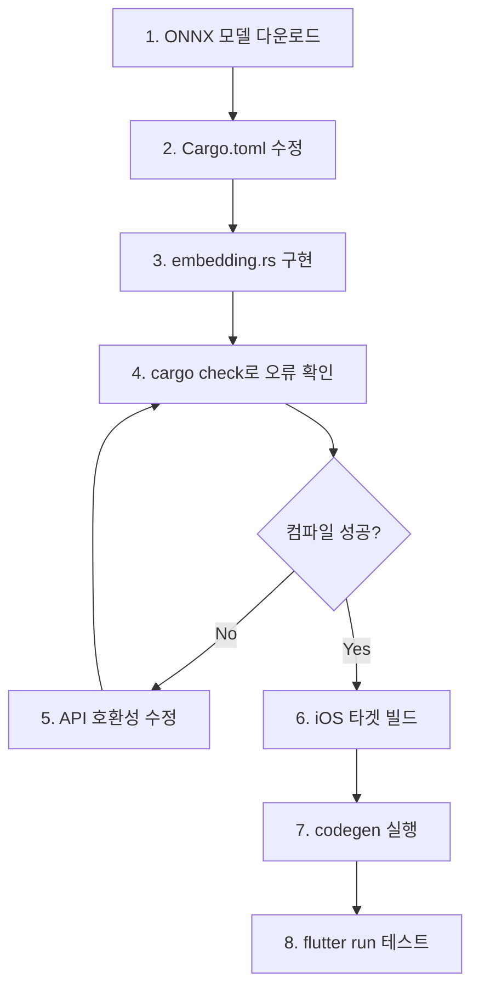

# ONNX Runtime (ort) 임베딩 통합 가이드

flutter_rust_bridge 프로젝트에 `ort` 크레이트를 사용하여 ONNX 임베딩 모델을 통합하는 가이드입니다.

---

## 사전 조건

- tokenizers 크레이트 통합 완료
- iOS/Android Rust 빌드 테스트 완료

---

## 1. ONNX 모델 다운로드

```bash
# MiniLM-L6-v2 ONNX 모델 (약 90MB)
wget -O assets/model.onnx \
  https://huggingface.co/onnx-models/all-MiniLM-L6-v2-onnx/resolve/main/model.onnx
```

**모델 정보:**
| 항목 | 값 |
|------|-----|
| 출력 차원 | 384 |
| 입력 | input_ids, attention_mask, token_type_ids |
| 크기 | ~90MB |

---

## 2. Rust 의존성 추가

### `rust/Cargo.toml`

```toml
[dependencies]
# ... 기존 의존성 ...

# ONNX Runtime for embedding model
ort = { version = "2.0.0-rc.10", default-features = false, features = ["load-dynamic", "ndarray"] }
```

### 주요 피처 설명

| 피처 | 설명 |
|------|------|
| `load-dynamic` | ONNX 라이브러리를 런타임에 로드 (iOS 정적 링킹 문제 우회) |
| `ndarray` | ndarray와의 호환성 (ArrayView 입출력) |

---

## 3. embedding.rs 구현

### 핵심 코드

```rust
use ort::session::Session;
use ort::value::Tensor;
use std::sync::Mutex;
use once_cell::sync::Lazy;
use std::borrow::Cow;

// 전역 세션 (모델 재사용)
static MODEL: Lazy<Mutex<Option<Session>>> = Lazy::new(|| Mutex::new(None));

/// 모델 초기화
pub fn init_model(model_path: String) -> Result<()> {
    let session = Session::builder()?
        .with_intra_threads(4)?
        .commit_from_file(&model_path)?;
    
    let mut global = MODEL.lock().unwrap();
    *global = Some(session);
    Ok(())
}

/// 임베딩 생성
pub fn generate_embedding_from_tokens(
    input_ids: Vec<i64>,
    attention_mask: Vec<i64>,
    token_type_ids: Vec<i64>,
) -> Result<Vec<f32>> {
    let mut guard = MODEL.lock().unwrap();  // ⚠️ mut 필수
    let session = guard.as_mut()?;
    
    // Tensor 생성
    let input_tensor = Tensor::from_array(([1usize, seq_len], input_ids))?;
    
    // 수동 입력 구성 (매크로 우회)
    let inputs = vec![
        (Cow::<str>::Borrowed("input_ids"), 
         ort::session::SessionInputValue::from(input_tensor)),
        // ... 나머지 입력
    ];
    
    // 추론
    let outputs = session.run(inputs)?;
    
    // 결과 추출
    let (shape, data) = output.try_extract_tensor::<f32>()?;
    // Mean pooling 적용...
}
```

---

## 4. 컴파일 오류 트러블슈팅

### 오류 1: `unresolved imports Session, Value`

```
error[E0432]: unresolved imports `ort::Session`, `ort::Value`
```

**원인**: ort v2.0.0-rc.10에서 API 구조 변경  
**해결**: 서브모듈에서 import

```rust
// ❌ 이전 (v1.x)
use ort::{Session, Value};

// ✅ 수정 (v2.0.0-rc.10)
use ort::session::Session;
use ort::value::Tensor;
```

---

### 오류 2: `ort::inputs!` 매크로 호환성

```
error[E0277]: the `?` operator cannot be applied to type `Vec<...>`
```

**원인**: `ort::inputs!` 매크로가 `Result`가 아닌 `Vec` 반환  
**해결**: 매크로 대신 수동으로 입력 구성

```rust
// ❌ 매크로 사용 (오류)
let outputs = session.run(ort::inputs![
    "input_ids" => tensor
]?)?;

// ✅ 수동 구성
let inputs = vec![
    (Cow::<str>::Borrowed("input_ids"), 
     ort::session::SessionInputValue::from(tensor)),
];
let outputs = session.run(inputs)?;
```

---

### 오류 3: `OwnedTensorArrayData` 트레이트 미구현

```
error[E0277]: the trait bound `ArrayBase<...>: OwnedTensorArrayData<_>` is not satisfied
```

**원인**: `ndarray` ArrayView를 직접 Tensor로 변환 불가  
**해결**: `(shape, data)` 튜플로 Tensor 생성

```rust
// ❌ ArrayView 직접 사용
Tensor::from_array(array.view())?

// ✅ 튜플 형태로 전달
Tensor::from_array(([1usize, seq_len], vec_data))?
```

---

### 오류 4: `try_extract_raw_tensor` 메서드 없음

```
error[E0599]: no method named `try_extract_raw_tensor` found
```

**원인**: 메서드 이름 변경  
**해결**: `try_extract_tensor` 사용

```rust
// ❌ 존재하지 않는 메서드
output.try_extract_raw_tensor::<f32>()?

// ✅ 올바른 메서드
let (shape, data) = output.try_extract_tensor::<f32>()?;
```

---

### 오류 5: `shape.0` 필드 접근 불가

```
error[E0609]: no field `0` on type `&ort::tensor::Shape`
```

**원인**: Shape가 튜플이 아닌 구조체  
**해결**: `iter()` 메서드 사용

```rust
// ❌ 튜플 접근
let dims: Vec<usize> = shape.0.iter().map(|&x| x as usize).collect();

// ✅ iter() 사용
let dims: Vec<usize> = shape.iter().map(|&x| x as usize).collect();
```

---

### 오류 6: `session.run()` 불변 참조 오류

```
error[E0596]: cannot borrow `*session` as mutable
```

**원인**: `session.run()`이 `&mut self` 요구  
**해결**: `as_ref()` → `as_mut()` 변경

```rust
// ❌ 불변 참조
let guard = MODEL.lock().unwrap();
let session = guard.as_ref()?;

// ✅ 가변 참조
let mut guard = MODEL.lock().unwrap();
let session = guard.as_mut()?;
```

---

## 5. iOS 빌드 특이사항

### load-dynamic 피처

`load-dynamic` 피처는 ONNX Runtime 라이브러리를 **런타임에 동적 로드**합니다.

**장점:**
- Rust 컴파일 시 ONNX 정적 라이브러리 불필요
- Flutter `onnxruntime` 패키지가 네이티브 라이브러리 제공

**필수 조건:**
- Flutter `onnxruntime` 패키지가 `pubspec.yaml`에 포함되어야 함
- iOS에서는 onnxruntime-objc가 자동 설치됨

---

## 6. 빌드 명령어

```bash
# Cargo 체크
cd rust && cargo check

# iOS 시뮬레이터 빌드 테스트
cd rust && cargo build --target aarch64-apple-ios-sim

# 코드 생성
flutter_rust_bridge_codegen generate

# 앱 실행
flutter run
```

---

## 7. 전체 도입 순서



---

## 요약: ort v2.0.0-rc.10 API 변경점

| 항목 | v1.x | v2.0.0-rc.10 |
|------|------|--------------|
| Session import | `ort::Session` | `ort::session::Session` |
| Value import | `ort::Value` | `ort::value::Tensor` |
| Tensor 생성 | `Value::from_array(arr)` | `Tensor::from_array((shape, vec))` |
| 입력 구성 | `ort::inputs!` | 수동 Vec 구성 |
| 결과 추출 | `extract_tensor()` | `try_extract_tensor()` → `(Shape, &[T])` |
| Session.run | `&self` | `&mut self` |
